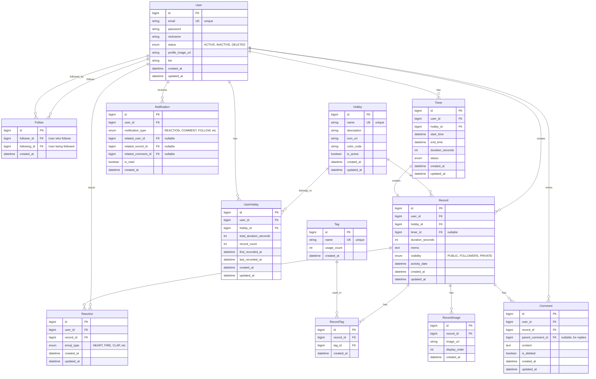

# Onuldo 데이터베이스 ER 다이어그램

## 전체 ER 다이어그램



## 테이블 상세 설계

### 1. users (사용자)
```sql
CREATE TABLE users (
    id BIGINT PRIMARY KEY AUTO_INCREMENT,
    email VARCHAR(100) NOT NULL UNIQUE,
    password VARCHAR(255) NOT NULL,
    nickname VARCHAR(50) NOT NULL,
    status ENUM('ACTIVE', 'INACTIVE', 'DELETED') NOT NULL DEFAULT 'ACTIVE',
    profile_image_url VARCHAR(255),
    bio VARCHAR(255),
    created_at TIMESTAMP(6) NOT NULL,
    updated_at TIMESTAMP(6) NOT NULL,
    INDEX idx_user_email (email)
);
```

### 2. hobbies (취미)
```sql
CREATE TABLE hobbies (
    id BIGINT PRIMARY KEY AUTO_INCREMENT,
    name VARCHAR(50) NOT NULL UNIQUE,
    description TEXT,
    icon_url VARCHAR(255),
    color_code VARCHAR(7),
    is_active BOOLEAN NOT NULL DEFAULT TRUE,
    created_at TIMESTAMP(6) NOT NULL,
    updated_at TIMESTAMP(6) NOT NULL,
    INDEX idx_hobby_name (name)
);
```

### 3. user_hobbies (사용자-취미 관계)
```sql
CREATE TABLE user_hobbies (
    id BIGINT PRIMARY KEY AUTO_INCREMENT,
    user_id BIGINT NOT NULL,
    hobby_id BIGINT NOT NULL,
    total_duration_seconds INT NOT NULL DEFAULT 0,
    record_count INT NOT NULL DEFAULT 0,
    first_recorded_at TIMESTAMP(6),
    last_recorded_at TIMESTAMP(6),
    created_at TIMESTAMP(6) NOT NULL,
    updated_at TIMESTAMP(6) NOT NULL,
    FOREIGN KEY (user_id) REFERENCES users(id) ON DELETE CASCADE,
    FOREIGN KEY (hobby_id) REFERENCES hobbies(id) ON DELETE CASCADE,
    UNIQUE KEY uk_user_hobby (user_id, hobby_id),
    INDEX idx_user_hobby_user (user_id),
    INDEX idx_user_hobby_hobby (hobby_id)
);
```

### 4. timers (타이머)
```sql
CREATE TABLE timers (
    id BIGINT PRIMARY KEY AUTO_INCREMENT,
    user_id BIGINT NOT NULL,
    hobby_id BIGINT NOT NULL,
    start_time TIMESTAMP(6) NOT NULL,
    end_time TIMESTAMP(6),
    duration_seconds INT NOT NULL DEFAULT 0,
    status ENUM('RUNNING', 'PAUSED', 'STOPPED') NOT NULL DEFAULT 'RUNNING',
    created_at TIMESTAMP(6) NOT NULL,
    updated_at TIMESTAMP(6) NOT NULL,
    FOREIGN KEY (user_id) REFERENCES users(id) ON DELETE CASCADE,
    FOREIGN KEY (hobby_id) REFERENCES hobbies(id) ON DELETE CASCADE,
    INDEX idx_timer_user (user_id),
    INDEX idx_timer_status (status)
);
```

### 5. records (기록)
```sql
CREATE TABLE records (
    id BIGINT PRIMARY KEY AUTO_INCREMENT,
    user_id BIGINT NOT NULL,
    hobby_id BIGINT NOT NULL,
    timer_id BIGINT,
    duration_seconds INT NOT NULL,
    memo TEXT,
    visibility ENUM('PUBLIC', 'FOLLOWERS', 'PRIVATE') NOT NULL DEFAULT 'PUBLIC',
    activity_date DATE NOT NULL,
    created_at TIMESTAMP(6) NOT NULL,
    updated_at TIMESTAMP(6) NOT NULL,
    FOREIGN KEY (user_id) REFERENCES users(id) ON DELETE CASCADE,
    FOREIGN KEY (hobby_id) REFERENCES hobbies(id) ON DELETE CASCADE,
    FOREIGN KEY (timer_id) REFERENCES timers(id) ON DELETE SET NULL,
    INDEX idx_record_user (user_id),
    INDEX idx_record_hobby (hobby_id),
    INDEX idx_record_date (activity_date),
    INDEX idx_record_visibility (visibility)
);
```

### 6. tags (태그)
```sql
CREATE TABLE tags (
    id BIGINT PRIMARY KEY AUTO_INCREMENT,
    name VARCHAR(50) NOT NULL UNIQUE,
    usage_count INT NOT NULL DEFAULT 0,
    created_at TIMESTAMP(6) NOT NULL,
    INDEX idx_tag_name (name)
);
```

### 7. record_tags (기록-태그 연결)
```sql
CREATE TABLE record_tags (
    id BIGINT PRIMARY KEY AUTO_INCREMENT,
    record_id BIGINT NOT NULL,
    tag_id BIGINT NOT NULL,
    created_at TIMESTAMP(6) NOT NULL,
    FOREIGN KEY (record_id) REFERENCES records(id) ON DELETE CASCADE,
    FOREIGN KEY (tag_id) REFERENCES tags(id) ON DELETE CASCADE,
    UNIQUE KEY uk_record_tag (record_id, tag_id),
    INDEX idx_record_tag_record (record_id),
    INDEX idx_record_tag_tag (tag_id)
);
```

### 8. record_images (기록 이미지)
```sql
CREATE TABLE record_images (
    id BIGINT PRIMARY KEY AUTO_INCREMENT,
    record_id BIGINT NOT NULL,
    image_url VARCHAR(255) NOT NULL,
    display_order INT NOT NULL DEFAULT 0,
    created_at TIMESTAMP(6) NOT NULL,
    FOREIGN KEY (record_id) REFERENCES records(id) ON DELETE CASCADE,
    INDEX idx_record_image_record (record_id)
);
```

### 9. follows (팔로우)
```sql
CREATE TABLE follows (
    id BIGINT PRIMARY KEY AUTO_INCREMENT,
    follower_id BIGINT NOT NULL,
    following_id BIGINT NOT NULL,
    created_at TIMESTAMP(6) NOT NULL,
    FOREIGN KEY (follower_id) REFERENCES users(id) ON DELETE CASCADE,
    FOREIGN KEY (following_id) REFERENCES users(id) ON DELETE CASCADE,
    UNIQUE KEY uk_follow (follower_id, following_id),
    INDEX idx_follow_follower (follower_id),
    INDEX idx_follow_following (following_id),
    CHECK (follower_id != following_id)
);
```

### 10. reactions (리액션)
```sql
CREATE TABLE reactions (
    id BIGINT PRIMARY KEY AUTO_INCREMENT,
    user_id BIGINT NOT NULL,
    record_id BIGINT NOT NULL,
    emoji_type ENUM('HEART', 'FIRE', 'CLAP', 'THUMBS_UP', 'STAR') NOT NULL,
    created_at TIMESTAMP(6) NOT NULL,
    updated_at TIMESTAMP(6) NOT NULL,
    FOREIGN KEY (user_id) REFERENCES users(id) ON DELETE CASCADE,
    FOREIGN KEY (record_id) REFERENCES records(id) ON DELETE CASCADE,
    UNIQUE KEY uk_reaction_user_record (user_id, record_id, emoji_type),
    INDEX idx_reaction_user (user_id),
    INDEX idx_reaction_record (record_id)
);
```

### 11. comments (댓글)
```sql
CREATE TABLE comments (
    id BIGINT PRIMARY KEY AUTO_INCREMENT,
    user_id BIGINT NOT NULL,
    record_id BIGINT NOT NULL,
    parent_comment_id BIGINT,
    content TEXT NOT NULL,
    is_deleted BOOLEAN NOT NULL DEFAULT FALSE,
    created_at TIMESTAMP(6) NOT NULL,
    updated_at TIMESTAMP(6) NOT NULL,
    FOREIGN KEY (user_id) REFERENCES users(id) ON DELETE CASCADE,
    FOREIGN KEY (record_id) REFERENCES records(id) ON DELETE CASCADE,
    FOREIGN KEY (parent_comment_id) REFERENCES comments(id) ON DELETE CASCADE,
    INDEX idx_comment_user (user_id),
    INDEX idx_comment_record (record_id),
    INDEX idx_comment_parent (parent_comment_id)
);
```

### 12. notifications (알림)
```sql
CREATE TABLE notifications (
    id BIGINT PRIMARY KEY AUTO_INCREMENT,
    user_id BIGINT NOT NULL,
    notification_type ENUM('REACTION', 'COMMENT', 'FOLLOW', 'REPLY') NOT NULL,
    related_user_id BIGINT,
    related_record_id BIGINT,
    related_comment_id BIGINT,
    is_read BOOLEAN NOT NULL DEFAULT FALSE,
    created_at TIMESTAMP(6) NOT NULL,
    FOREIGN KEY (user_id) REFERENCES users(id) ON DELETE CASCADE,
    FOREIGN KEY (related_user_id) REFERENCES users(id) ON DELETE SET NULL,
    FOREIGN KEY (related_record_id) REFERENCES records(id) ON DELETE CASCADE,
    FOREIGN KEY (related_comment_id) REFERENCES comments(id) ON DELETE CASCADE,
    INDEX idx_notification_user (user_id),
    INDEX idx_notification_read (is_read),
    INDEX idx_notification_created (created_at)
);
```

## 관계 요약

### 1:N 관계
- User → Timer (한 사용자는 여러 타이머를 가질 수 있음)
- User → Record (한 사용자는 여러 기록을 작성할 수 있음)
- User → Reaction (한 사용자는 여러 리액션을 할 수 있음)
- User → Comment (한 사용자는 여러 댓글을 작성할 수 있음)
- Hobby → Record (한 취미는 여러 기록에 사용될 수 있음)
- Record → RecordTag (한 기록은 여러 태그를 가질 수 있음)
- Record → RecordImage (한 기록은 여러 이미지를 가질 수 있음)
- Record → Comment (한 기록은 여러 댓글을 가질 수 있음)
- Comment → Comment (대댓글, 자기 참조)

### N:M 관계
- User ↔ Hobby (UserHobby를 통한 중간 테이블)
- User ↔ User (Follow를 통한 팔로우 관계)
- Record ↔ Tag (RecordTag를 통한 중간 테이블)

### 1:1 관계
- Timer → Record (타이머는 하나의 기록을 생성)

## 주요 인덱스 전략

1. **조회 성능 최적화**
   - `users.email`: 로그인 시 사용
   - `records.user_id`, `records.activity_date`: 사용자별 기록 조회
   - `records.visibility`: 피드 필터링
   - `follows.follower_id`, `follows.following_id`: 팔로우 관계 조회

2. **통계 쿼리 최적화**
   - `user_hobbies.user_id`, `user_hobbies.hobby_id`: 취미별 통계
   - `records.activity_date`: 날짜별 통계

3. **알림 최적화**
   - `notifications.user_id`, `notifications.is_read`: 미읽음 알림 조회

## 데이터 무결성 제약

1. **UNIQUE 제약**
   - `users.email`: 이메일 중복 방지
   - `hobbies.name`: 취미 이름 중복 방지
   - `tags.name`: 태그 이름 중복 방지
   - `follows(follower_id, following_id)`: 중복 팔로우 방지
   - `reactions(user_id, record_id, emoji_type)`: 같은 리액션 중복 방지

2. **CHECK 제약**
   - `follows`: 자기 자신을 팔로우할 수 없음

3. **CASCADE 정책**
   - User 삭제 시 관련 데이터 모두 삭제 (소프트 삭제 권장)
   - Record 삭제 시 관련 태그, 이미지, 댓글 삭제
   - Comment 삭제 시 대댓글도 삭제 (실제 삭제 대신 is_deleted 플래그 사용 권장)

